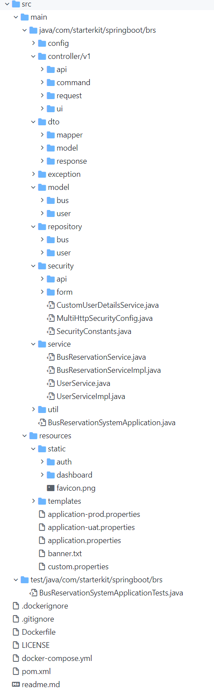
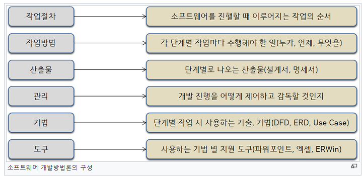

### SpringBoot Structure

##### 간단한 용어정리

    - 이데올로기( 이념 )
        일반적으로 사람이 인간, 자연, 사회에 대해 규정짓는
        현실적이면서 동시에 이념적인 의식의 형태

    - 보일러플레이트(코드)
        컴퓨터 프로그래밍에서 변화없이 여러군데에서 반복되는 코드를 말한다.
        주로 옛날에 만들어진 언어에서 많이 나타나는데,
        프로그래머는 사소한 기능 하나 만드는데도
        수 많은 코드를 작성해야한다.
        - 예시) VO마다 Getter, Setter

스프링 프레임워크는 수백 개의 bean과 서비스가 있는  
엔터프라이즈급 애플리케이션에 악몽으로 판명된  
XML의 복잡한 구조(구성)을 잘 알고있다.

스프링은 설정이 반이라는 농담이 있을정도로  
설정을 잡는 것은 쉬운 일이 아니다.

기본 context.xml 파일을 만들어  
bean을 일일히 등록해주어야 한다.

스프링 레거시 프로젝트 기반으로 공부를 하다가  
스프링부트로 공부로 넘어온 사람들은  
설정이 잡아먹는 시간과 노력에 대해 많은 체감을 느낄 것이다.

요즈음 대세인 마이크로서비스로 이동하는 추세에  
스프링 레거시보다 스프링부트를 이용한다면  
독립형 스프링 기반 애플리케이션을 쉽게 설정할 수도 있다.  
새로운 마이크로서비스를 가져오고 배포하기 쉬운 데에서 이상적이다.

또한 훨신적은 데이터플레이트코드를 사용하게 되고  
hibernate mapping으로 인해  
데이터를 억세스하는데 부하가 줄어든다.

스프링부트를 사용한다면 "그냥 실행" 이 가능한  
독립 실행형 프로덕션을 생성할 수 있다.

대부분의 스프링부트 애플리케이션에는  
스프링 레거시의 구성이 거의 필요하지 않다.

#### 스프링부트의 장점은

    - 쉬운 Dependency 관리
    - Embed Tomcat, Jetty 혹은 Undertow를 포함하고있다.
      (WAR file을 배포할 필요가 없다)
    - 스프링 스타터로 간단히 configuration을 build한다.
    - 스프링과 3rd party 라이브러리를 자동으로 configure한다.
    - XML 구성에 대한 요구사항이 없다.
    - 코드 변경시 서버를 자동으로 다시 시작한다.



간단한 스프링 부트의 Startkit(이데올로기)이다

각 역할을 하는 패키지로 구성한다.

#### Model, DTO

```java
@Getter
@Setter
@Accessors(chain = true)
@NoArgsConstructor
@ToString
@JsonInclude(value = JsonInclude.Include.NON_NULL)
@JsonIgnoreProperties(ignoreUnknown = true)

public class TripDto {


  private String id;

  private int fare;

  private int journeyTime;

  private String sourceStopCode;

  private String sourceStopName;

  private String destinationStopCode;

  private String destinationStopName;

  private String busCode;

  private String
```

```java
@Getter
@Setter
@Accessors(chain = true)
@NoArgsConstructor
@ToString
@JsonInclude(value = JsonInclude.Include.NON_NULL)
@JsonIgnoreProperties(ignoreUnknown = true)
public class TripDto {


  private String id;

  private int fare;

  private int journeyTime;

  private String sourceStopCode;

  private String sourceStopName;

  private String destinationStopCode;

  private String destinationStopName;

  private String busCode;

  private String agencyCode;

}
```

DTO는 전체 Model Object가 아닌  
User Interface와 공유해야하는 데이터만을 위해 사용한다.

Database의 mirror 이미지가 아닌  
User Interface 또는 API Request가 요구하는것을 정의한다.

이런식으로 구조를 잡는다면 HTTP를 통해  
Server에서 Client로 이동하는 응답 패킷의 전체크기를 줄일 수 있다.

#### Service, DAO(Repository or Mapper)

DAO(Data Access Object)는 Repository 패캐지에 있다.

이것들은 서비스 계층이 DB에서 데이터를 유지하고 검색하도록 돕는  
Repository Interface의 확장이다.

서비스 레이어는 service 패키지 아래에 정의한다.

서비스 레이어와 컨트롤러 계층이 상호작용을하여  
API Request를 받을때마다 작업을 한다.

요청을 받을 때 Model Object에 대한 Access 권한이 없어야 하며  
항상 DTO측면과 Conversation 해야한다.

서비스가 DTO Object를 수신하면 DB에서  
해당 Model Object를 Mapping하여 필요한 작업을 수행한 뒤

다시 Response DTO를 생성하여 Controller로 전송해야한다.

이 접근방식을 사용한다면 View와 Model을 독립적으로 사용할 수 있다.

#### Controller

Request를 intercept하는 순간과  
Response를 준비하여 다시 전송되는것을 함께 묶는다.

ui 관련 컨트롤러는 ui패키지에 있고  
관련 명령 Object는 Command 패키지 아래에 구성한다.

REST API Controller는 api패키지 아래에 있으며  
해당 Request Class는 Request 패키지 아래에 구성한다.

    이데올로기는 완전히 정해진 것은 없다.
    들어오는 Request를 Mapping하기 위해 별도의 Class를 생성하는것과,
    DTO를 사용하거나, Model을 직접적으로 사용하는것에 대한 의견은 분분하다.

---

### 방법론

##### 간단한 용어정리

    - UML(Unified Modeling Language)
        1997년 OMG(Object Management Group)에서
        표준으로 채택한 통합모델링언어(모델을 만드는 표준언어)이다.
        모델이란 것은 어떤 것을 실제로 만들 때
        이렇게 만들면 잘 작동할지 미리 검증해보는 것이다.

#### 정의

- 소프트웨어 개발방법론은 소프트웨어를 어떻게 만들지에 대해 관심을 가진다. 따라서 개발 방법론에는 단계별 산출물뿐만 아니라 산출물은 누가 어떤 순서로 어떻게 만들어야 하는지 그리고 어떤 도구를 사용해야 하는지 구체적으로 정의한다.



#### 역사

    - 1969년까지 구조적 프로그래밍이 주로 쓰였다.

    - 1980년대 구조적 시스템 분석과 설계 방법론이 쓰였다.

    - 1990년대 객체 지향 프로그래밍이 1960년대부터 개발되어,
      1990년대 중반에 주류 개발 방법론이 된다.

    - 고속 개발 방법론이 1991년부터 쓰인다.

    - 스크럼이 1990년 후반부터 쓰인다.

    - SEI의 와츠 험프리가 팀 소프트웨어 프로세스를 개발한다.

    - 2000년대 익스트림 프로그래밍이 1999년부터 쓰인다.

    - 래셔널 통합 프로세스 (RUP)가 1998년부터 쓰인다.

    - 스콧 앰블러가 2005년에 애자일 통합 프로세스 (AUP)를 시작한다.

##### 소프트웨어의 개발 방법론은 크게 4가지로 나눌수 있다.

    1. 정보공학 방법론

    2. 객체지향 방법론

    3. CBD방법론

    4. 애자일 방법론

4가지 방법론의 단점을 보완하거나  
각각의 방법론의 장점을 따온 개발론도 있다.

[방법론 종류](http://wiki.hash.kr/index.php/%EC%86%8C%ED%94%84%ED%8A%B8%EC%9B%A8%EC%96%B4_%EA%B0%9C%EB%B0%9C%EB%B0%A9%EB%B2%95%EB%A1%A0)

---

### 폭포수 모델

#### 정의

**폭포수 모델**(Waterfall Model)이란 소프트웨어 개발 시  
단계적으로 개발하는 방법론을 말한다.

분석 → 설계 → 개발( 디자인 → 퍼블리싱 → 프로그래밍 )  
→ 테스트 → 적용 → 안정화의 단계를 따른다.

폭포수가 거슬러 올라갈 수 없듯이,  
소프트웨어 개발도 반드시 앞 단계가 먼저 완료되어야  
다음 단계의 개발을 진행할 수 있다는 뜻이다.

소프트웨어 개발 방법론(SDM)의 일종이다.  
반대말은 애자일 개발 방법론이다.

#### 특징

폭포수 모델은 SW 개발을 단계적, 순차적, 체계적으로 접근한다.  
프로젝트 진행과정에 대해서 관리가 용이하지만  
목표 시스템이 후반에 가서야 구체화 되므로  
**중요한 문제점이 프로젝트 후반부에 발견** 될 수 있다.

#### 구성

SDLC(Software Development Life Cycle)에서 많이 반복되는 구성 단계로  
**'계획수립->요구분석->설계->개발/구현->테스트->유지보수'** 단계를 순차적으로  
진행하며 각 단계 종료 시 검증 후에 다음 단계를 진행한다.

전 단계에서 결함 발견 시 피드백을 받고,  
각 단계별 산출물을 명확하게 정의한다.

기술적 위험성이 낮거나 유사프로젝트 경험이 많은 경우에 사용한다.

##### 장점

    - 고전적인 방법론으로써 적용 사례가 풍부하다.
    - 전체 과정의 이해가 쉽다.
    - 현재 단계에 대한 이해가 빠르고 쉽다.
    - 문서, 산출물의 관리와 적용이 쉽다.

##### 단점

    - 병행 작업이 안된다.
    - 피드백에 대한 반복 단계가 어렵다.
    - 테스트 단계에 발견된 중요 결함에 대한 대응이 어렵다.
    - 고객 요구사항에 대한 상세한 반영이 어렵다.

#### 활용

    - 응용분야를 잘 알고 있거나, 단순한 프로젝트를 개발할 때 용이하다.

    - 비전문가가 사용할 시스템을 개발하는 데 적합하다.

    - 단계 종료 후에 나와야 하는 산출물에 대한
      명확한 정의가 필요한 사이트 제작에 사용하기 좋다.

    - 초기에 정의한 요구사항 변경이 적은 프로그램에 적용해 사용하기 좋다.

---

### 애자일

#### 정의

애자일 개발 방법론은 소프트웨어 개발 방법론에 있어서

아무런 계획이 없는 개발 방법과  
계획이 지나치게 많은 개발 방법들 사이에서 타협점을 찾고자 하는 방법론이다.

계획을 통해 주도하는 과거의 방법론과 달리 앞을 예측하며 개발하지 않고,  
일정한 주기를 가지고 끊임없이 프로토타입을 만들어내며  
필요한 요구사항을 추가 및 수정을 통해 소프트웨어를 개발하는 것이다.

애자일 개발 방법론은 제한된 시간과 비용 안에서  
정보는 불완전하고 예측은 불가능하다는 전제하에  
합리적인 답을 내도록 하는 것이다.

#### 특징

    - 고객과 개발자의 지속적인 소통을 통하여 요구사항의 변화를 이행한다.

    - 개발자 개인의 가치보다는 팀의 목적을 우선시하며
      고객의 의견을 가장 우선시한다.

    - 주기적인 회의를 통한 프로젝트를 점검한다.

    - 진행하면서 프로그램을 시행해보고 고객으로부터 피드백을 받는다.

    - 비용절감에 힘쓰는 동시에 프로그램 품질 향상을 위해 노력한다.

#### 폭포수 모델과의 차이점?

전통적인 개발 방법론들은 [폭포수 모델](http://wiki.hash.kr/index.php/%ED%8F%AD%ED%8F%AC%EC%88%98_%EB%AA%A8%EB%8D%B8)과 계획 기반 개발을 따르지만,  
애자일 개발 프로세스는 전통적인 개발 방법론에 반한다는 점이  
큰 차이를 가진다.

전통적인 개발 방법론들은 계획적 개발을 기반으로 개발을 진행한다.

이는 이해와 사용이 쉬운 바람적인 기법이지만  
계획대로 진행되지 않을 때 가장 큰 부작용이 발생하게 된다는 단점이 있다

#### [애자일 소프트웨어 개발 선언](https://agilemanifesto.org/iso/ko/manifesto.html)

```
우리는 소프트웨어를 개발하고, 또 다른 사람의 개발을 도와주면서

소프트웨어 개발의 더 나은 방법들을 찾아가고 있다.

이 작업을 통해 우리는 다음을 가치 있게 여기게 되었다.

    - 공정과 도구보다 개인과 상호작용을
    - 포괄적인 문서보다 작동하는 소프트웨어를
    - 계약 협상보다 고객과의 협력을
    - 계획을 따르기보다 변화에 대응하기를

가치 있게 여긴다. 이 말은, 왼쪽에 있는 것들도 가치가 있지만,

우리는 오른쪽에 있는 것들에 더 높은 가치를 둔다는 것이다
```

#### 애자일 소프트웨어 개발 12대 원칙

- 고객 만족

- 변화 수용

- 자주 납품

- 팀으로 작업

- 동기 부여

- 대면 소통가동성 측정

- 속도 일정 유지

- 품질 최우선

- 복잡하지 않게

- 설계 진화

- 규칙적 반영

#### 애자일의 핵심은 협력과 피드백이다.

##### 협력

프로젝트 실패의 경우는 기술 외적인 것도 크다.  
특히 소프트웨어 개발의 불확실성이 높을 때는  
협력을 통해 이를 프로젝트의 실패를 방지해야 한다.

###### 내부적 협력

소프트웨어을 개발한 팀 안에서 하는 협력을 말하며  
특히, 직무 역할을 넘어선 협력을 의미한다.

    1.  협력을 통해 한 사람의 좋은 통찰을 다른 사람도 함께 얻을 수 있다.

    2.  예상하지 못했던 기회를 잡을 수 있다.
        - 예시) 개발속도가 빠른 사람의 코드 협력의
                시스템에서 문제가 발생할 수 있을 때,
                협력을 통해 해당 문제점을 찾아 개선할 수 있고
                이로 인해 팀 전체의 개발 속도 빨라지고
                더 나은 발전 점을 찾을 수 있다.

    3.  문제점이나 예상하지 못했던 문제를 방지할 수 있다.
        - 예시) 한 명의 생각이나 관점으로 찾을 수 없는 문제나 오류들을
                협력을 통해 다른 사람의 생각이나 관점에서 바라볼 수 있어
                해당 문제점들을 찾고 빠르게 해결할 수 있다.

##### 피드백

피드백은 학습의 가장 큰 전제조건으로 어떻게 했는지 확인하며 학습해야 한다.

모르는 것이 많을수록 빨리 배워야 하므로  
소프트웨어 개발의 불확실성이 높을수록 학습은 중요하다.

###### 내부적 피드백

직접 개발한 프로젝트가 어떻게 됐는지 확인하는 것이다.

###### 외부적 피드백

직접 개발한 프로젝트를 고객이나 다른 부서가 사용해보고 그것을 통해 또 다른 것을 배우는 것이다.

---

#### 애자일 개발 방법론 종류

##### 스크럼

30일마다 동작 가능한 제품을 제공하는 **스프린트(Sprint)** 를 중심으로 하는
개발 방법론이다.  
매일 정해진 시간과 장소에서 짧은 시간의 개발을 하는 팀을 위한  
프로젝트 관리 중심의 방법론이다.

##### 익스트림 프로그래밍

애자일 개발 프로세스의 대표적인 개발 방법론으로

애자일 개발 방법론 보급에 큰 역할을 담당했다.

이 방법론은 클라이언트와 함께 2주 정도의 반복 개발을 하고

테스트 우선 개발(TDD)을 특징으로 하는 명시적인 기술과 방법을 가지고 있다.

##### 크리스털 패밀리

크리스털 패밀리는 프로젝트의 규모와 영향의 크기에 따라 여러 종류의 방법론을 제공한다.

그중 가장 소규모 팀에 적용하는 크리스털 클리어는 익스트림 프로그래밍만큼 엄격하지도 않고 효율이 높지 않지만,

프로젝트에 적용하기 쉬운 개발 방법론이다.

##### Feature-Driven Development

Feature-Driven Development는 feature마다 2주 정도의 반복 개발을 진행한다.

Peter Coad가 제창하는 방법론으로, UML을 이용한 설계 기법과도 밀접한 관련이 있다.

##### 적응형 소프트웨어 개발

적응형 소프트웨어 개발(Adaptive Software Development)은 소프트웨어 개발을 혼란으로 규정하고

혼란을 대전제로 그에 적응할 수 있는 소프트웨어 방법을 제시하기 위해 만들어진 방법론이다.

내용상으로는 다른 방법론들과 유사하지만,

합동 애플리케이션(Joint Application Development, 사용자나 고객이 설계에 참가하는 개발 방법론)을 사용하는 것이 다르다.

##### 익스트림 모델링

익스트림 모델링(extreme modeling)은 UML을 이용한 모델링 중심 방법론이다.

다른 모델링 방법들과는 달리 언제나 실행과 검증할 수 있는 모델을 작성하는 공정을 반복해서,

최종적으로 모델로부터 자동적으로 제품을 생성하게 한다.
