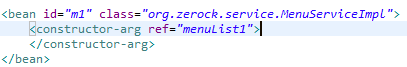

### Spring IOC/DI

## 스프링의 특징

**1. POJO(Plain Old Java Object) 방식**  
**2. 관점 지향 프로그래밍(Aspect Oriented Programming, AOP)**  
**3. 의존성 주입(Dependency Injection, DI)**  
**4. 제어 역전(Inversion of Control, IoC)**  
**5. 생명주기 관리**

IoC/DI는 스프링의 핵심개발 원칙이다.

스프링의 3대 기술인 AOP,PSA도 IoC/DI에 바탕을 두고있다.

왜 두 개의 오브젝트를 분리해서 만들고 인터페이스를 두고

느슨하게 연결한 뒤 실제 사용할 대상은 DI를 통해 외부에서 지정하나?

이렇게 DI방식으로 하는것이 new 키워드로 생성해서 사용하는 강한 결합을 쓰는 방법보다 나은가?

간단한 답변은 '**유연한 확장이 가능하게 위해서**' 이다.

DI는 개방 폐쇄 원칙(OCP)이라는 객체지향 설계원칙으로 설명된다.

"자신의 확장에는 열려 있어야 하며, 주변 변화에 있어서는 닫혀있어야 한다."

```
 - 공장을 한다면 그 물건을 홍보도 해야하고,
   판매도 해야하고, 제조도 해야한다. (확장에 열려있다)

 - 직원들이 바뀐다 해도
   물건은 항상 일정하게 나와야 한다. (변화에 닫혀있다)
```

```java
public class 1번공장 {

    public void 부품만들기(String 부품명) {

        if(name == "1번부품"){
            System.out.println("1번부품을 만듭니다.");
        } else if(name == "2번부품"){
            System.out.println("2번부품을 만듭니다.");
        } else {
            System.out.println("부품명을 입력해주세요.");
        }
    }
}

public class 2번공장 {

    public void 부품만들기(String 부품명) {

        if(name == "1번부품"){
            System.out.println("1번부품을 만듭니다.");
        } else if(name == "2번부품"){
            System.out.println("2번부품을 만듭니다.");
        } else {
            System.out.println("부품명을 입력해주세요.");
        }
    }
}

public class 공장회사 {

    public static void main(String\[\] args) {

        1번공장 공장1 = new 1번공장();
        2번공장 공장2 = new 2번공장();

        1번공장.부품만들기("1번부품");
        2번공장.부품만들기("2번부품");
    }
}
```

문제가 무엇일까?

두 카페의 운영자 공장회사 클래스에서는 1번,2번 공장 인스턴스를 생성 후

부품만들기 메소드를 호출해 사용하고 있다.

동작을 하는데 있어 문제는 없지만 만약 서로 다른 공장에

새로운 부품이 추가적으로 발생된다면 부품만들기 메소드에

if문은 서로 다르게 또 끝도 없이 길어질 수 있다.

즉, 변화에 있어서 닫혀있지 못한 코드이다.

그렇다면 어떻게 이 코드를 OCP가 지켜질 수 있도록 수정할 수 있을까?

일단 공통적인 부분을 추려내보도록 하자.

일반적으로 공장에서는 부품을 만든다는 공통점을 가지고 있다.

코드를 변화해보자.

```java
public interface 중앙공장 {

public void 부품만들기();

}

public class 1번공장 implements 중앙공장 {

    private String 부품명 = "";

    public void set부품(String 부품명){

        this.부품명 = 부품명;
    }

    public void 부품만들기() {

        System.out.println(부품명 + "을 만듭니다.");
        }
    }

public class 2번공장 implements 중앙공장 {

    private String 부품명 = "";

    public void set부품(String 부품명){

        this.부품명 = 부품명;
    }

    public void 부품만들기() {

        System.out.println(부품명 + "을 만듭니다.");
    }

}

public class 공장회사 {

    public static void main(String\[\] args) {

        중앙공장 중앙공장 = new 중앙공장();

        cm.set부품("1번부품");
        cm.부품만들기();

        cm.set부품("2번부품");
        cm.부품만들기();

    }

}
```

인터페이스를 상속받은 1번공장, 2번공장 클래스에는 카페 관리자로부터  
제조할 부품의 이름을 받아 private 변수에 넣어주는 set부품 메소드가 추가되었다.

이로써 우리는 if문을 하나씩 추가해주지 않아도  
원하는 부품 얼마든지 만들어낼 수 있게 되었다.

즉, **변경이 발생해도 기본 구조는 수정되지 않기 때문에**  
**변화에 닫혀 있다**고 볼 수 있으며 부품을 만드는 기능 이외에

다른 기능들도 쉽게 추가해서 사용할 수 있기 때문에 확장에 열려있다고 할 수 있다.

**유연한 확장은 OCP의 '확장에는 열려있다(개방)'에 해당**하고,

**'변경에는 닫혀있다(폐쇄)에도 해당**한다.  
**폐쇄 관점에서의 장점은** '**재사용이 가능**하다' 로 볼 수 있다.

예를 들어 서비스 오브젝트가 사용하는 DAO가 있을때  
DAO의 구현을 JDBC, JPA, 하이버네이트, JDO, iBatis 등으로 변경한다.

**구현 방식을 통째로 바꾸는 것**이다.

만일 사용자 관리 서비스라고 한다면  
사용자의 등급을 결정하는 정책을 담은 코드를 DI로 분리한다.

만약 비즈니스 로직이 변경돼서 새로운 정책을 적용한다면  
DI를 이용해서 새로운 정책을 담은 클래스로  
통째로 변경해주면 된다.

이런 기능 외에도 **핵심기능의 동적인 변경**도 가능하다.

예를 들어 사용자의 등급에 따라 다른 DataSource를 사용하게 할 수도 있다.  
DAO는 DataSource에 의존한다.(DAO -> DataSource)  
그런데 DAO하나가 여러 개의 DataSource에 의존하게 할 수도 있다.

그리고 사용자의 등급에 따라  
그때그때 다른 DataSource를 DAO가 사용하게 할 수도 있다.  
VIP사용자는 좀 더 속도가 빠른 DB를 이용하게 해서  
빠른 처리 속도를 보장해주기 위해 적용할 수 있는 기법이다.

**심지어 DAO를 따로 만들 필요도 없다.**

대신 매우 지능적인 방식으로 동작하는 DI덕분에  
**선택적으로 사용할 DataSource를 바꿔주는 기법이 가능**하다.

이렇게 **동적인 방식으로 핵심기능을 변경**하는 것은  
기술적인 관점에서는 **다이나믹 라우팅 프록시**나  
**프록시 오브젝트 기법을 활용**한 것이다.

이러한 기법 적용이 가능한것은 **DI가 있기 때문**이다.  
만일 **DI가 없었다면 불가능**하다.

세번째 활용 방법으론 **핵심기능은 그대로 두고 부가기능을 추가할 수 있다.**  
**트랜잭션 기능을 부여한것이 대표적인 예**다.

전달 파라미터를 조작하거나 파라미터나 리턴 결과를 활용하여  
로깅이나 보안처리같은 **부가적인 작업 수행이 가능**하다.

부가기능의 추가 방식을 특정 오브젝트가 아닌  
더 많은 대상으로 일반화 해서 적용하면 **AOP**가 된다.

---

#### 싱글톤과 오브젝트 스코프

DI가 필요한 중요한 이유 중 한 가지는 **DI 할 오브젝트의 생명주기를 제어**할 수 있다는 것이다.  
DI를 프레임워크로 이용한 다는 건 **DI 대상 오브젝트를 컨테이너가 관리**한다는 의미다.

오브젝트의 생성부터 관계설정, 이용, 소멸에 이르기까지  
모든 과정을 **DI컨테이너가 주관**하기때문에 그 오브젝트의 스코프를 **자유롭게 제어**할 수 있다.

가장 **기본이 되는 스코프는 싱글톤**이다.  
스프링의 DI는 기본적으로 **싱글톤으로 오브젝트를 만들어서 사용**한다.  
컨테이너가 **알아서** 싱글톤으로 만들어서 관리하기 때문에  
**클래스 자체는 싱글톤을 고려하지 않고 자유롭게 설계해도 되는 장점**이 있다.

하지만 떄로 당일 싱글톤이 아니라 임의의 생명주기를 갖는 오브젝트가 필요할 때가 있다.  
스프링에서 **싱글톤 이외에 다양한 스코프를 갖는 오브젝트를 만들어서 DI에 사용**할 수도 있다.  
HTTP요청당 하나의 오브젝트를 만들거나 HTTP세션당 하나씩 오브젝트가 만들어지게 할 수도 있다.

**DI의 중요한 용도는 바로 테스트**다.

다른 오브젝트와 협력하여 동작하는 오브젝트를  
효과적으로 테스트하는방법은 **가능한 고립**시키는 것이다.  
자칫 다른 오브젝트와 협력을 통해 동작하는 기능을 다 허용하고  
테스트하다가는 한번에 수십 개의 오브젝트와 DB, 환경까지  
모두 테스트하는 부담을 안을수도 있다.

그래서 테스트할 대상이  
**의존하는 오브젝트를 테스트를 목적으로 만들어진 목 오브젝트로 대처**하면 유용하다.  
갈수록 테스트의 중요성이 커져가고 있으니  
DI의 활용방법에서 테스트가 차지하는 비중도 커질것이다.

이외에 **템플릿과 콜백, 프록시** 등 다양한 활용방법이 있다.  
런타임시 유연하게 구현을 바꿀 수 있는 DI라는 개념이 실전에서 얼마나 활용도가 높은지 알 수 있다.  
이러한 활용방법은 **한 번에 한 가지만 선택적으로 사용해야만 하는것이 아니다.**

여러가지 활용 방법을 **한 번에 적용**할 수도 있다.

예로 하나의 DI 대상에 대해 핵심기능도 업무 변화에 따라 바꾸고,  
부가기능도 추가하고, 테스트에서 활용 하는 방법도 가능하다.

---

#### BEAN

자바의 객체는 두가지종류가 있다

**중요한것과 중요하지않은것.**

빈으로 잡는 기준이 있다.

예로 vo/dto가 있다.
라이프사이클이 짧은애들은 빈으로 잡지않는다.  
무조건으로 객체를 빈에 등록하지않는다.  
라이프사이클이 비교적 긴 메소드만 빈에 추가한다.

---

**의존성주입을 받을땐 인터페이스를 사용한다(유연성을 높이기 위함)**


빈에등록하면 컨트롤은 스프링이 직접한다.


객체로 직접만들지않았지만 obj로 자동으로 스프링이 만들어졌다.  
스프링은 싱글톤으로 만들어주지않아도 기본적으로 싱글톤이다.


인스턴스로 만들지 못한다는 에러가 난다.  
스프링2.5버전 이후부터 좋은기능들이 나왔다.  
그 중 하나는 생성자를 만든다는것은 객체를 아무렇게나 만들지 못하게한다는 제약이다.  
메뉴를 넣지않으면 객체로 만들지 못하게한다는 뜻이다.


ArrayList를 쓰기위해서 빈에 추가를 해줘야한다.



참조를 빈에다가 직접 추가해줬다.


빈에 추가했더니 서비스가 주입이되었다.  
객체간의 연결을 와이어링이라고 한다.

---

##### 의존성주입이 왜 좋은가 ?

스프링에서 의존성주입은 인터페이스를 만들지않아도 가능하다.

서비스에서 바로 컨트롤러로 꽂는것도가능하지만  
인터페이스 선언해서 의존성 주입을 하는 진짜 이유는  
내가 나중에 나한테 의존적인 객체를 다른객체로 바꿔칠때  
그 실체객체를 몰라도 코딩이 가능하다

##### 의존성 주입 방식은 무엇이 있나 ?

```
1. 생성자 주입(Constructor Injection)
2. 필드 주입(Field Injection)
3. 수정자 주입(Setter Injection)
```

Lombok을 사용하여 final과 @RequiredConstructor를 사용하는게 안전하다

필드주입인 @Autowired는 외부에서 변경이 불가능하다는 단점이있다.  
**실제코드와는 무관한 테스트환경에서만 사용**한다.

생성자 주입을 통해 변경의 가능성을 배제하고 불변성을 보장한다.  
스프링이외에도 스프링만 가능한게 아니고 다른것도 가능하긴하다.

EnterpriseEdition6 부터 @Inject 어너테이션을 사용해서 DI가 가능하다.  
(테스트해보니 안된다..)

##### 의존성 주입하는 어노테이션은 무엇이 있나?

```
1. @Autowired
2. @Resource(@Qualifier)
3. @Inject(Java에서 지원하는 Annotation Java EE)
등..
```

**JUnit Framework 테스트는 스프링모듈을 사용하지않는다.**

---

### 스프링컨테이너

Spring Container는 Spring Framework에서  
**핵심적인 역할을 담당하는 컴포넌트**다.  
스프링 컨테이너는 객체의 생성, 초기화, 관리, 소멸과 같은  
라이프사이클을 관리하고, 애플리케이션의 구성 요소들을 제어하며,  
애플리케이션의 실행 환경을 제공한다.

스프링 컨테이너는 두 가지 타입이 있다.

```
1.  BeanFactory

    스프링 컨테이너의 가장 기본적인 형태이며,
    스프링에서 객체 생성 및 관리를 담당한다.
    객체를 사용하는 시점에 객체를 생성하며,
    빈을 실제로 사용하지 않을 경우에는 생성하지 않는다.

2.  ApplicationContext

    BeanFactory의 기능을 모두 포함하며,
    더 다양한 기능들을 제공한다.
    빈 객체를 미리 생성해 놓는 등,
    애플리케이션 실행에 필요한 다양한 설정을 제공하며,
    메시지, 환경 설정, 리소스 등을 다루는 기능도 제공한다.
    또한, AOP와 같은 고급 기능을 지원한다.
```

스프링 컨테이너를 사용하면 객체의 생성과 관리를 스프링이 담당하므로,  
객체 간의 의존성을 관리하기 용이하며, 유지보수와 테스트가 쉬워진다.  
또한, 스프링의 DI와 같은 기능을 사용하여 객체 간의 결합도를 낮출 수 있다.

**BeanFactory**를 사용하는 것도 가능하지만,  
**ApplicationContext**를 사용하는 것이 더 일반적이다.

**BeanFactory**는 스프링에서 객체 생성 및 관리를 담당하는 가장 기본적인 형태의 컨테이너다.

**BeanFactory**는 애플리케이션 실행 중에 필요한 객체를 생성하는데,  
실제로 사용할 때 객체를 생성하기 때문에 초기 로딩 시간이 많이 소요된다.

애플리케이션이 시작되는 시점에 대부분의 빈 객체가 로딩되어야 하는 경우,  
**BeanFactory**를 사용하는 것은 성능 저하를 유발할 수 있다.

따라서, 일반적으로 **ApplicationContext**를 사용하는 것이 더 효율적이고 선호되는 방법이다.

다만, 규모가 작은 애플리케이션에서는 **BeanFactory**를 사용하여 경량화된 애플리케이션을 구현하는 것도 가능하다.

---

##### Bean을 관리할때 @Qualifier, @PreDestroy를 무조건 써줘야하는가 ?

**@Qualifier**와 **@PreDestroy**는 필요에 따라서 사용하는 것이 좋다.

**@Qualifier**는 같은 타입의 빈 객체가 여러 개일 때,  
원하는 빈 객체를 선택하여 의존성 주입을 할 수 있도록 지정해주는 역할을 한다.

즉, 의존성 주입 시 어떤 빈 객체를 사용할지 결정하는데 도움을 준다.

따라서, 같은 타입의 빈 객체가 여러 개일 때,  
어떤 빈 객체를 사용할지 명시적으로 지정해주는 것이 좋다.

**@PreDestroy**는 빈 객체가 소멸되기 전에 호출되는 메서드를 지정할 때 사용한다.

빈 객체가 사용 후에는 반드시 정리(clean-up) 작업을 수행해야 하는데,  
이때 **@PreDestroy** 메서드를 사용하면 빈 객체가 소멸되기 전에 정리 작업을 수행할 수 있다.

따라서, 빈 객체가 소멸될 때 필요한 후처리 작업을 수행해야 할 경우, **@PreDestroy**를 사용하는 것이 좋다.

하지만, **@Qualifier**와 **@PreDestroy**는 항상 사용해야 하는 것은 아니다.  
만약 빈 객체가 유일하거나, 후처리 작업이 필요하지 않은 경우에는 사용하지 않아도 무방하다.

따라서, 상황에 따라서 사용할지 여부를 판단하여 적절하게 사용하는 것이 좋다.

**@PreDestroy** 메서드는 빈 객체가 소멸될 때 호출되는 메서드로,  
스프링에서는 이를 자동으로 호출해주는 기능을 제공한다.

스프링 컨테이너는 빈 객체의 생명주기를 관리하기 위해  
빈 객체의 초기화(init) 메서드와 소멸(destroy) 메서드를 호출한다.

빈 객체의 초기화 메서드는 객체가 생성될 때 호출되며,  
소멸 메서드는 컨테이너가 빈 객체를 소멸시킬 때 호출된다.

즉, **@PreDestroy**는 스프링에서 자동으로 처리해주는 기능이므로,  
개발자가 별도로 호출할 필요가 없다.

단지, 빈 객체에서 **@PreDestroy** 메서드를 정의하고  
**@PreDestroy** Annotation을 붙여주면 된다.
